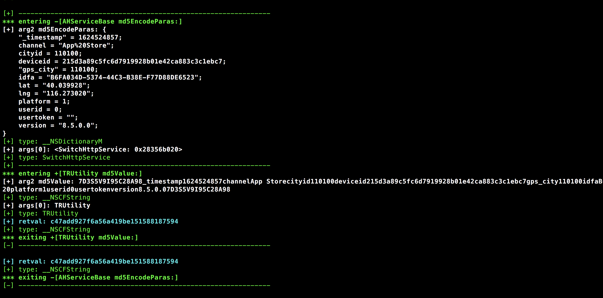
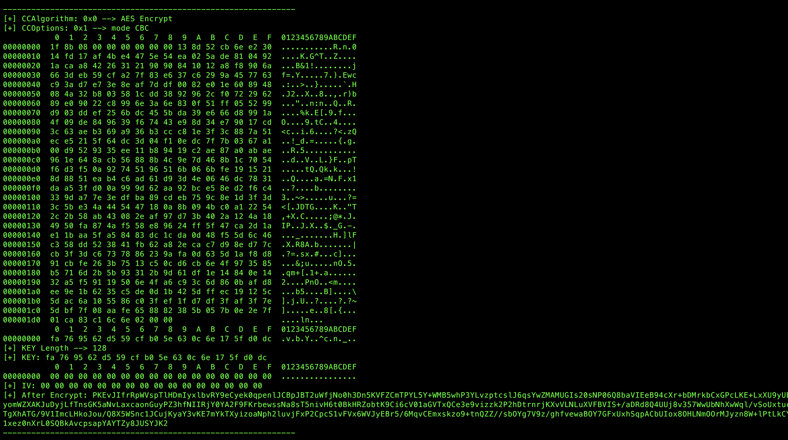
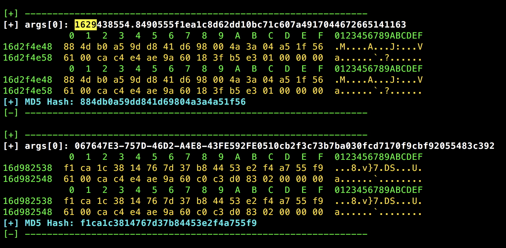
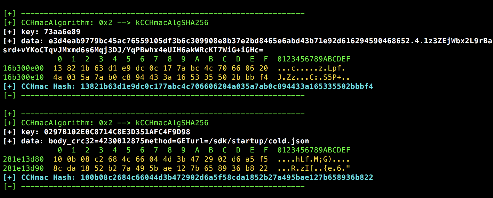

## Frida-scripts
分享个人工作中一些事半功倍的脚本
### iOS_Trace.js
#### 说明
* 根据关键词模糊Hook Objective-C方法，可以对类名和方法名模糊Hook，参考[FridaDev](https://github.com/houugen/FridaDev)，在此基础上进行了修改。
* 对Objective-C的地址进行判断（防止解析出错），默认拦截所有的@id对象类型的参数和返回值，并区分着色。
* 当拦截方法较多时，为避免Hook无关的关键词造成性能问题，可以对关键词通过filter列表设置过滤。
* 关键词大小写敏感，逆向找突破口的时候可尽情发挥想象力。
#### 举例
**trace("\*[\* \*md5\*]")--> 模糊Hook某应用签名**

### CC_Hook_2Base64.js
#### 说明
* 博客中[秒破iOS APP加密数据](https://la0s.github.io/2018/12/07/iOS_Crypto/)中的脚本优化。  
* 由于原始CCCrypt函数的加解密结果存在原始的字节流，不方便查找和过滤，故增加Base64转化过程。
* 当KEY与IV不是明文时，以Hex形式打印，并对原始的CCCrypt函数参数进行翻译。
#### 举例
**拦截CCCrypt加密过程**

### CC_MD5.js
#### 说明
* 对CC_MD5函数进行拦截。  
#### 举例
**拦截某应用MD5加密结果**

### CC_SHA1.js   CCHmac.js
#### 说明
* 对CC_SHA1  CCHmac函数进行拦截。
#### 举例
**拦截某应用Hmac加密过程及密钥**

